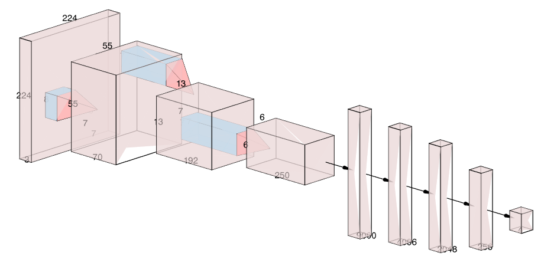

# Custom-AlexNet-For-Chest-Cancer-Classification-Detection
A PyTorch-based deep learning project for lung cancer classification using a custom-built AlexNet architecture, including data preprocessing, model training, and performance evaluation.
🖼️ Model Architecture

  

📂 Dataset
Dataset Source
Kaggle Dataset:
[Insert Dataset Link Here]
Dataset Classes
Class	Description
Adenocarcinoma	Lung adenocarcinoma
Squamous Cell Carcinoma	Squamous cell carcinoma
Large Cell Carcinoma	Large cell carcinoma
Normal	Healthy lung tissue
